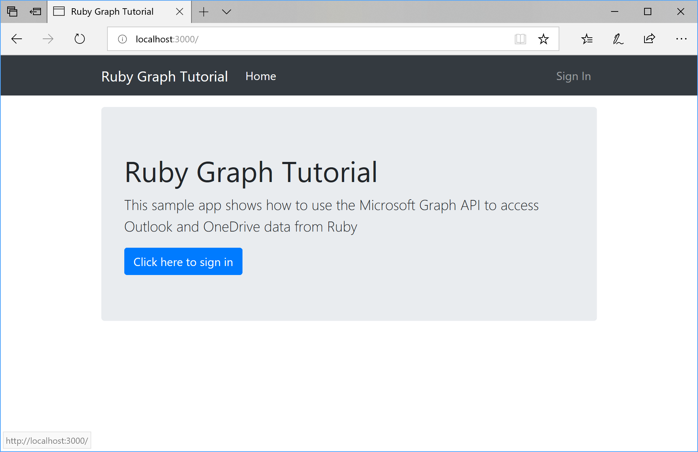

<!-- markdownlint-disable MD002 MD041 -->

<span data-ttu-id="b134f-101">In dieser Übung verwenden Sie [Ruby on Rails](https://rubyonrails.org/) , um eine Webanwendung zu erstellen.</span><span class="sxs-lookup"><span data-stu-id="b134f-101">In this exercise you will use [Ruby on Rails](https://rubyonrails.org/) to build a web app.</span></span>

1. <span data-ttu-id="b134f-102">Wenn Rails nicht bereits installiert ist, können Sie es über die Befehlszeilenschnittstelle (CLI) mit dem folgenden Befehl installieren.</span><span class="sxs-lookup"><span data-stu-id="b134f-102">If you don't already have Rails installed, you can install it from your command-line interface (CLI) with the following command.</span></span>

    ```Shell
    gem install rails -v 6.0.2.2
    ```

1. <span data-ttu-id="b134f-103">Öffnen Sie die CLI, navigieren Sie zu einem Verzeichnis, in dem Sie Berechtigungen zum Erstellen von Dateien haben, und führen Sie den folgenden Befehl aus, um eine neue Rails-APP zu erstellen.</span><span class="sxs-lookup"><span data-stu-id="b134f-103">Open your CLI, navigate to a directory where you have rights to create files, and run the following command to create a new Rails app.</span></span>

    ```Shell
    rails new graph-tutorial
    ```

1. <span data-ttu-id="b134f-104">Navigieren Sie zu diesem neuen Verzeichnis, und geben Sie den folgenden Befehl ein, um einen lokalen Webserver zu starten.</span><span class="sxs-lookup"><span data-stu-id="b134f-104">Navigate to this new directory and enter the following command to start a local web server.</span></span>

    ```Shell
    rails server
    ```

1. <span data-ttu-id="b134f-105">Öffnen Sie Ihren Browser und navigieren Sie zu `http://localhost:3000`.</span><span class="sxs-lookup"><span data-stu-id="b134f-105">Open your browser and navigate to `http://localhost:3000`.</span></span> <span data-ttu-id="b134f-106">Wenn alles funktioniert, wird ein "yay!" angezeigt.</span><span class="sxs-lookup"><span data-stu-id="b134f-106">If everything is working, you will see a "Yay!</span></span> <span data-ttu-id="b134f-107">Sie sind auf Schienen! "</span><span class="sxs-lookup"><span data-stu-id="b134f-107">You're on Rails!"</span></span> <span data-ttu-id="b134f-108">Nachricht.</span><span class="sxs-lookup"><span data-stu-id="b134f-108">message.</span></span> <span data-ttu-id="b134f-109">Wenn diese Meldung nicht angezeigt wird, überprüfen Sie das [Handbuch Rails-erste Schritte](http://guides.rubyonrails.org/).</span><span class="sxs-lookup"><span data-stu-id="b134f-109">If you don't see that message, check the [Rails getting started guide](http://guides.rubyonrails.org/).</span></span>

## <a name="install-gems"></a><span data-ttu-id="b134f-110">Installieren von Gems</span><span class="sxs-lookup"><span data-stu-id="b134f-110">Install gems</span></span>

<span data-ttu-id="b134f-111">Bevor Sie fortfahren, sollten Sie einige zusätzliche Edelsteine installieren, die Sie später verwenden werden:</span><span class="sxs-lookup"><span data-stu-id="b134f-111">Before moving on, install some additional gems that you will use later:</span></span>

- <span data-ttu-id="b134f-112">[omniauth-oauth2](https://github.com/omniauth/omniauth-oauth2) für die Verarbeitung von Anmelde-und OAuth-Token-Flows.</span><span class="sxs-lookup"><span data-stu-id="b134f-112">[omniauth-oauth2](https://github.com/omniauth/omniauth-oauth2) for handling sign-in and OAuth token flows.</span></span>
- <span data-ttu-id="b134f-113">[omniauth-rails_csrf_protection](https://github.com/cookpad/omniauth-rails_csrf_protection) zum Hinzufügen von CSRF-Schutz zu omniauth.</span><span class="sxs-lookup"><span data-stu-id="b134f-113">[omniauth-rails_csrf_protection](https://github.com/cookpad/omniauth-rails_csrf_protection) for adding CSRF protection to OmniAuth.</span></span>
- <span data-ttu-id="b134f-114">[httparty](https://github.com/jnunemaker/httparty) zum tätigen von Anrufen an Microsoft Graph.</span><span class="sxs-lookup"><span data-stu-id="b134f-114">[httparty](https://github.com/jnunemaker/httparty) for making calls to Microsoft Graph.</span></span>
- <span data-ttu-id="b134f-115">[ActiveRecord-session_store](https://github.com/rails/activerecord-session_store) zum Speichern von Sitzungen in der Datenbank.</span><span class="sxs-lookup"><span data-stu-id="b134f-115">[activerecord-session_store](https://github.com/rails/activerecord-session_store) for storing sessions in the database.</span></span>

1. <span data-ttu-id="b134f-116">Öffnen Sie **/Gemfile** , und fügen Sie die folgenden Zeilen hinzu.</span><span class="sxs-lookup"><span data-stu-id="b134f-116">Open **./Gemfile** and add the following lines.</span></span>

    :::code language="ruby" source="../demo/graph-tutorial/Gemfile" id="GemFileSnippet":::

1. <span data-ttu-id="b134f-117">Führen Sie in der CLI den folgenden Befehl aus.</span><span class="sxs-lookup"><span data-stu-id="b134f-117">In your CLI, run the following command.</span></span>

    ```Shell
    bundle install
    ```

1. <span data-ttu-id="b134f-118">Führen Sie in der CLI die folgenden Befehle aus, um die Datenbank zum Speichern von Sitzungen zu konfigurieren.</span><span class="sxs-lookup"><span data-stu-id="b134f-118">In your CLI, run the following commands to configure the database for storing sessions.</span></span>

    ```Shell
    rails generate active_record:session_migration
    rake db:migrate
    ```

1. <span data-ttu-id="b134f-119">Erstellen Sie eine neue Datei `session_store.rb` mit dem Namen im Verzeichnis **./config/initializers** , und fügen Sie den folgenden Code hinzu.</span><span class="sxs-lookup"><span data-stu-id="b134f-119">Create a new file called `session_store.rb` in the **./config/initializers** directory, and add the following code.</span></span>

    :::code language="ruby" source="../demo/graph-tutorial/config/initializers/session_store.rb" id="SessionStoreSnippet":::

## <a name="design-the-app"></a><span data-ttu-id="b134f-120">Entwerfen der App</span><span class="sxs-lookup"><span data-stu-id="b134f-120">Design the app</span></span>

<span data-ttu-id="b134f-121">In diesem Abschnitt erstellen Sie die grundlegende Benutzeroberfläche für die app.</span><span class="sxs-lookup"><span data-stu-id="b134f-121">In this section you'll create the basic UI for the app.</span></span>

1. <span data-ttu-id="b134f-122">Öffnen Sie **./app/views/Layouts/Application.html.Erb** , und ersetzen Sie den Inhalt durch Folgendes.</span><span class="sxs-lookup"><span data-stu-id="b134f-122">Open **./app/views/layouts/application.html.erb** and replace its contents with the following.</span></span>

    :::code language="html" source="../demo/graph-tutorial/app/views/layouts/application.html.erb" id="LayoutSnippet":::

    <span data-ttu-id="b134f-123">Dieser Code fügt [Bootstrap](http://getbootstrap.com/) zur einfachen Formatierung hinzu, und [Font Awesome](https://fontawesome.com/) für einige einfache Symbole.</span><span class="sxs-lookup"><span data-stu-id="b134f-123">This code adds [Bootstrap](http://getbootstrap.com/) for simple styling, and [Font Awesome](https://fontawesome.com/) for some simple icons.</span></span> <span data-ttu-id="b134f-124">Außerdem wird ein globales Layout mit einer Navigationsleiste definiert.</span><span class="sxs-lookup"><span data-stu-id="b134f-124">It also defines a global layout with a nav bar.</span></span>

1. <span data-ttu-id="b134f-125">Öffnen Sie **/App/Assets/Stylesheets/Application.CSS** , und fügen Sie Folgendes am Ende der Datei hinzu.</span><span class="sxs-lookup"><span data-stu-id="b134f-125">Open **./app/assets/stylesheets/application.css** and add the following to the end of the file.</span></span>

    :::code language="css" source="../demo/graph-tutorial/app/assets/stylesheets/application.css" id="CssSnippet":::

1. <span data-ttu-id="b134f-126">Generieren Sie mit dem folgenden Befehl einen Startseiten-Controller.</span><span class="sxs-lookup"><span data-stu-id="b134f-126">Generate a home page controller with the following command.</span></span>

    ```Shell
    rails generate controller Home index
    ```

1. <span data-ttu-id="b134f-127">Konfigurieren Sie `index` die Aktion auf `Home` dem Controller als Standardseite für die app.</span><span class="sxs-lookup"><span data-stu-id="b134f-127">Configure the `index` action on the `Home` controller as the default page for the app.</span></span> <span data-ttu-id="b134f-128">Öffnen Sie **./config/routes.RB** , und ersetzen Sie den Inhalt durch Folgendes:</span><span class="sxs-lookup"><span data-stu-id="b134f-128">Open **./config/routes.rb** and replace its contents with the following</span></span>

    ```ruby
    Rails.application.routes.draw do
      get 'home/index'
      root 'home#index'

      # Add future routes here

    end
    ```

1. <span data-ttu-id="b134f-129">Öffnen Sie **./app/View/Home/Index.html.Erb** , und ersetzen Sie den Inhalt durch Folgendes.</span><span class="sxs-lookup"><span data-stu-id="b134f-129">Open **./app/view/home/index.html.erb** and replace its contents with the following.</span></span>

    :::code language="html" source="../demo/graph-tutorial/app/views/home/index.html.erb" id="HomeSnippet":::

1. <span data-ttu-id="b134f-130">Speichern Sie alle Änderungen, und starten Sie den Server neu.</span><span class="sxs-lookup"><span data-stu-id="b134f-130">Save all of your changes and restart the server.</span></span> <span data-ttu-id="b134f-131">Nun sollte die APP sehr unterschiedlich aussehen.</span><span class="sxs-lookup"><span data-stu-id="b134f-131">Now, the app should look very different.</span></span>

    
